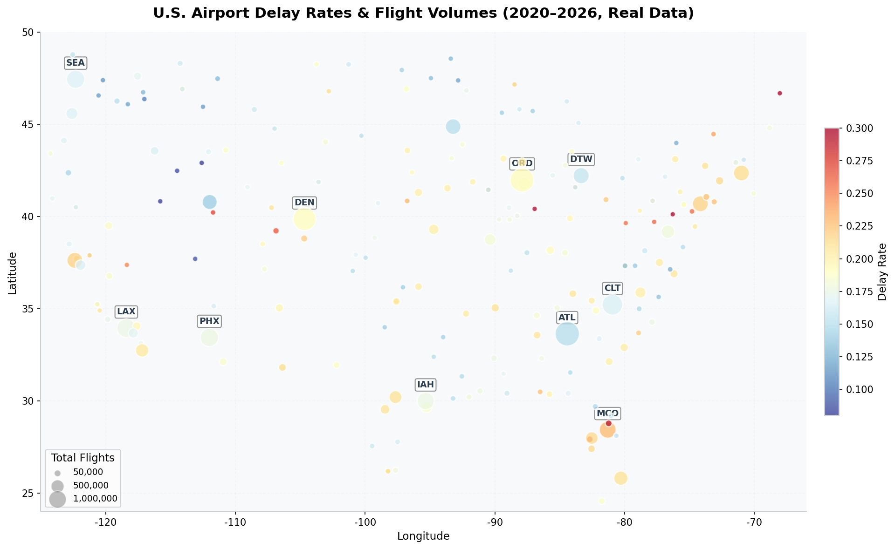
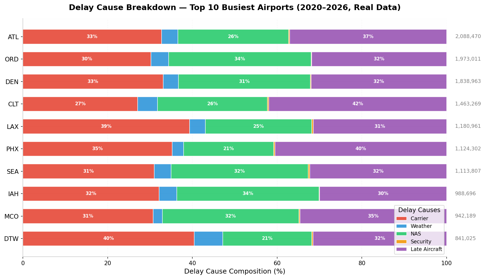
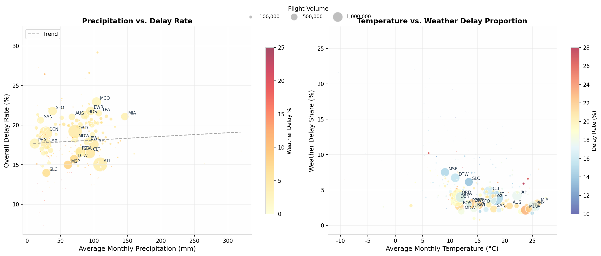
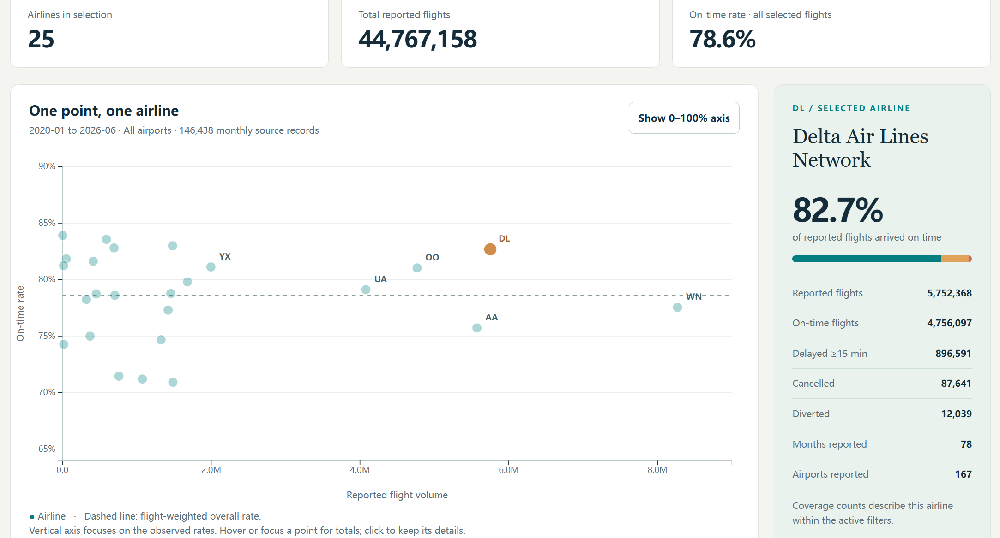

# Final Project Milestone: Interim Check-In

## 1. Dataset

### Raw Datasets

- **Flight source:** [U.S. Bureau of Transportation Statistics (BTS), Airline On-Time Statistics and Delay Causes](https://www.transtats.bts.gov/ot_delay/OT_DelayCause1.asp?20=E).
- **Flight data:** 146,704 carrier–airport–month records with 21 columns, covering January 2020–June 2026 (78 months), 392 airport codes, and 25 carrier codes. Key fields include `year`, `month`, `carrier`, `airport`, `arr_flights`, `arr_del15`, cancellations, diversions, and counts/minutes for five delay causes.
- **Weather source:** NOAA Global Summary of the Month files, with 20,951 unique station–month observations across 274 stations in the supplied collection (January 2020–September 2026). We restrict weather data to January 2020–June 2026 for the merge. Key variables include precipitation, temperature, wind, station coordinates, and source attributes. These are monthly summaries, not individual-flight weather observations.

### Processed Dataset

- **Description:** Two aggregated CSV files derived from the prepared airport–month weather table: (1) `airport_summary.csv` — airport-level aggregation summing all delay causes and averaging weather metrics across the full time period; (2) `top10_causes.csv` — subset of the 10 busiest airports with computed delay-cause percentages.
- **Number of Observations:** `airport_summary.csv`: 224 rows (one per airport); `top10_causes.csv`: 10 rows
- **Variables Used:** `airport`, `arr_flights`, `delay_rate`, `weather_pct`, `noaa_PRCP`, `noaa_TAVG`, plus five cause percentages (`carrier_ct_pct`, `weather_ct_pct`, `nas_ct_pct`, `security_ct_pct`, `late_aircraft_ct_pct`)

#### Prepared Flight and Weather Tables

- **`bts_monthly_clean.csv`:** 146,438 usable carrier–airport–month records, retaining all 392 airports for flight-only views.
- **`airport_weather_monthly.csv`:** 16,508 airport–month records across **224 airports**, joined to supplied NOAA stations whose distance from the airport is at most 25 km. This is the processed input for the airport/weather summaries above. The matching process verifies supplied assignments; it does not automatically select the nearest station.
- **`flight_weather_monthly.csv`:** 92,861 matched carrier–airport–month records for weather comparisons with airline filters. Weather repeats across carriers at the same airport–month, so weather values must not be summed across carriers.
- **Visualization 4 data:** [airline_performance.csv](data/airline_performance.csv) contains **25 carrier-level rows**, aggregated from all 146,438 cleaned flight records. It includes reported flights, on-time flights/rate, delayed arrivals, cancellations, diversions, and delay-cause totals. The scatter plot uses the full flight dataset rather than restricting airlines to airports with NOAA coverage.

### Data Cleaning and Processing

1. **Type conversion:** Parsed all numeric columns (delay counts, weather metrics, coordinates) from string to float; coerced invalid entries to NaN.
2. **Aggregation:** Grouped raw airport-month data by airport code, summing `arr_flights`, `arr_del15`, and all five delay-cause counts; computed mean `noaa_PRCP` and `noaa_TAVG` per airport.
3. **Derived fields:** Calculated `delay_rate` = `arr_del15 / arr_flights`; `weather_pct` = `weather_ct / total_causes × 100`; and proportional percentages for all five delay causes.
4. **Geographic filtering:** Retained only continental U.S. airports (longitude −125 to −66, latitude 24 to 50) to ensure valid projection on the Albers USA map.

#### Additional Preparation for Visualization 4 and the Weather Join

- Removed 266 flight records with all flight metrics missing; retained an exclusion log.
- Set missing delayed-arrival counts to zero in 241 records only when all reported flights were cancelled/diverted and all five cause counts were zero. These changes are flagged.
- Grouped airlines by carrier code and used the latest observed name for display, preserving source names in the clean table.
- Calculated `on_time_flights = arr_flights − arr_del15 − arr_cancelled − arr_diverted`, then `on_time_rate = sum(on_time_flights) / sum(arr_flights)`. Cancellations and diversions are not counted as on-time arrivals. We sum counts before dividing rather than averaging monthly percentages.
- Preserved and flagged 80 flight rows whose reported delay-cause totals do not reconcile; these flags matter for cause-composition views but do not change the scatter plot's arrival totals.
- Used one combined NOAA station file to avoid ingesting the same station records twice. Validated supplied station assignments against airport coordinates, excluding 10 assignments beyond 25 km and one unresolved coordinate match; joined by airport code, accepted station, and calendar month. Weather missing values and source attributes remain intact. NOAA CSV temperatures use degrees Celsius and precipitation uses millimeters.
- Checked all 78 reporting months, unique record keys, valid rates, aggregation totals, and merge cardinality. The June 2026 on-time calculation rounds to BTS's published national rate of 73.12%.

---

## 2. Visualizations

### Visualization 1: U.S. Airport Delay Map

**Purpose:** To reveal the geographic distribution of flight delays across the United States and identify regional patterns. Bubble size encodes total flight volume (larger = busier airport), while color encodes delay rate (red = higher delay, blue = lower delay). This allows users to simultaneously compare "how busy" and "how delayed" each airport is.

### Visualization 2: Delay Cause Breakdown — Top 10 Busiest Airports

**Purpose:** To decompose overall delays into their five reported causes (Carrier, Weather, NAS, Security, Late Aircraft) for the busiest airports. Using 100% stacked horizontal bars, users can compare the "delay DNA" of each airport—e.g., whether one airport suffers disproportionately from weather while another is dominated by late aircraft.

### Visualization 3: Weather vs. Delay Rate Scatter Plot

**Purpose:** To investigate the relationship between meteorological conditions and flight delays. The left panel plots average monthly precipitation against overall delay rate; the right panel plots average temperature against weather-delay share. Bubble size represents flight volume, and color encodes weather-delay percentage, enabling multi-dimensional outlier detection.

### Visualization 4: Airline Performance Scatter Plot

**Purpose:** To compare airline reliability and operational scale. Each point represents one carrier. Horizontal position encodes total reported flights; vertical position encodes the flight-weighted on-time rate. The dashed line marks the overall on-time rate across the selected flights. This supports comparing airlines with different traffic volumes and identifying carriers for closer inspection.

**Implemented visualization using actual project data:** The static chart below uses January 2020–June 2026 BTS records. It shows 25 carriers aggregated from 146,438 cleaned carrier–airport–month records. Labels identify the eight busiest carriers, and the adjacent table lists all carriers. The vertical axis is explicitly limited to 65–90% to make rate differences visible. Different reporting periods and service mixes mean the chart is a descriptive comparison, not an adjusted ranking.

[Open the working interactive Visualization 4](vis/viz4_airline_performance.html) · [Download the carrier-level data](data/airline_performance.csv)

---

## 3. Interaction / Animation Plan

### Visualization 1 — Airport Delay Map

**Planned Interaction / Animation:**
- **Year filter dropdown:** A `&lt;select&gt;` dropdown (2020–2026) will re-aggregate data to a single selected year and transition bubble sizes/colors with D3 `.transition().duration(600)`.
- **Zoom and pan:** Integrate `d3.zoom()` so users can zoom into dense regions (e.g., Northeast corridor) without losing context.
- **Enhanced tooltip:** On hover, display a sparkline mini-chart showing the selected airport's monthly delay rate trend.

**Purpose:** To support temporal exploration—users can observe whether an airport's delay performance improved or worsened over the pandemic/recovery years. Zoom prevents occlusion in high-density regions.

### Visualization 2 — Delay Cause Stacked Bars

**Planned Interaction / Animation:**
- **Sort buttons (already implemented):** Clicking "By Weather %" or "By Late Aircraft %" re-sorts bars with a 500ms D3 transition.
- **Drill-down on click:** Clicking an airport's bar will expand a detail panel below showing a monthly stacked-area trend chart for that specific airport.
- **Hover highlight:** Hovering a segment dims other segments to emphasize the selected cause.

**Purpose:** Sorting enables different analytical perspectives (e.g., finding the most weather-vulnerable airport regardless of size). Drill-down supports from-overview-to-detail navigation, a key dashboard pattern.

### Visualization 3 — Weather Scatter Plot

**Planned Interaction / Animation:**
- **Brush filtering (already implemented):** `d3.brush()` lets users drag a rectangle to filter points; double-click resets.
- **Linked highlighting:** Brushed points in the scatter plot will highlight corresponding bubbles on the Map (cross-view linking).
- **Play slider (temporal animation):** A range slider stepping through years will animate dot positions, showing how the precipitation-delay relationship shifts seasonally.

**Purpose:** Brush filtering supports exploratory subset analysis (e.g., "show me only airports with &gt;100mm rain and &gt;20% delay"). Temporal animation reveals whether weather-delay correlations strengthen in winter months.

### Visualization 4 — Airline Performance Scatter Plot

**Already Implemented:**
- **Date-range and airport filters:** Recalculate carrier totals and rates for the selection, allowing comparisons within the same period and airport.
- **Tooltips and pinned details:** Hover or keyboard-focus a point to see flight totals; click or press Enter to retain the carrier's on-time, delayed, cancelled, and diverted counts and reporting coverage.
- **Airline highlighting:** Highlight one carrier while keeping the comparison airlines visible.
- **Axis toggle, reset, and CSV export:** Switch between the observed rate range and a full 0–100% scale, restore the initial view, and download the currently displayed carrier summary.

**Planned Interaction / Animation:**
- **Animated updates:** Add short D3 transitions when filters change so users can track each carrier's movement; respect reduced-motion preferences.
- **Coordinated filters:** Share date and airport selections with the map and cause views. Clearly label when a weather view has a smaller matched-airport population.

**Purpose:** Support fairer comparisons within a chosen context, explain each point's denominator, and help users follow changes across coordinated views without losing track of the selected airline.

---

## 4. Evaluation Plan

### What Will Be Evaluated?

- **Encoding effectiveness:** Whether the map's dual encoding (size + color) allows users to quickly identify high-delay, high-volume airports without confusion.
- **Interaction intuitiveness:** Whether users understand how to use sort buttons, brush filters, and the reset mechanism (double-click) without explicit instruction.
- **Insight generation:** Whether users can identify and describe patterns supported by the displayed data, distinguish associations from causation, and recognize when coverage limits a comparison.

- **Visualization 4:** Whether users correctly read volume versus on-time rate, recognize the focused vertical axis, understand that cancellations/diversions are not on time, and notice differences in airline reporting coverage.

### How Will It Be Evaluated?

- **Cognitive walkthrough:** Each group member will complete three timed tasks: (a) locate the airport with the highest weather-delay percentage, (b) use brush to count airports with &gt;150mm precipitation and &gt;18% delay, (c) identify which delay cause dominates ATL. We record completion time and error counts.
- **Heuristic evaluation:** We will inspect the visualization against Nielsen's 10 heuristics, with special attention to **system status visibility** (does the user know what filter is active?), **error prevention** (is the brush reset obvious?), and **flexibility** (do sort buttons offer meaningful alternatives?).
- **Peer review:** We will ask another project group to interact with the D3 prototype for 5 minutes and verbalize their thought process; we will note where they hesitate or misinterpret encodings.

- **Visualization 4 task test:** Ask peers to (a) identify the busiest carrier, (b) select June 2026 and ORD, then report United's on-time rate and flight count, and (c) switch to the full percentage axis and reset the filters. Record correctness, completion time, misclicks, requests for help, and any misinterpretation of the axes or denominator. Expected values will be checked against independent CSV aggregations.
- **Visualization 4 functional checks already completed:** Verified date/airport filters, highlighting, keyboard selection, axis switching, invalid-date handling, reset, and CSV export against prepared totals. No browser console errors were observed. Peer usability testing remains planned.

### Data / Feedback to Be Collected

- **Task metrics:** Completion time per task (target &lt; 20 seconds), number of misclicks, and whether the user needed to ask for help.
- **Questionnaire:** Three Likert-scale items ("The color scale was intuitive," "I understood how to reset the brush," "The sort buttons helped me see new patterns") plus one open-ended question: "What additional interaction would you want?"
- **Interaction logs:** Screen recordings of peer-review sessions to analyze common navigation paths and stumbling blocks.
- **Visualization 4 feedback:** Add two 1–5 agreement items: “I understood what each point and axis represented” and “I could compare an airline within a selected period and airport.” Ask one open-ended question: “What made the airline comparison difficult or potentially misleading?” Recordings will be collected only with participants' agreement.
